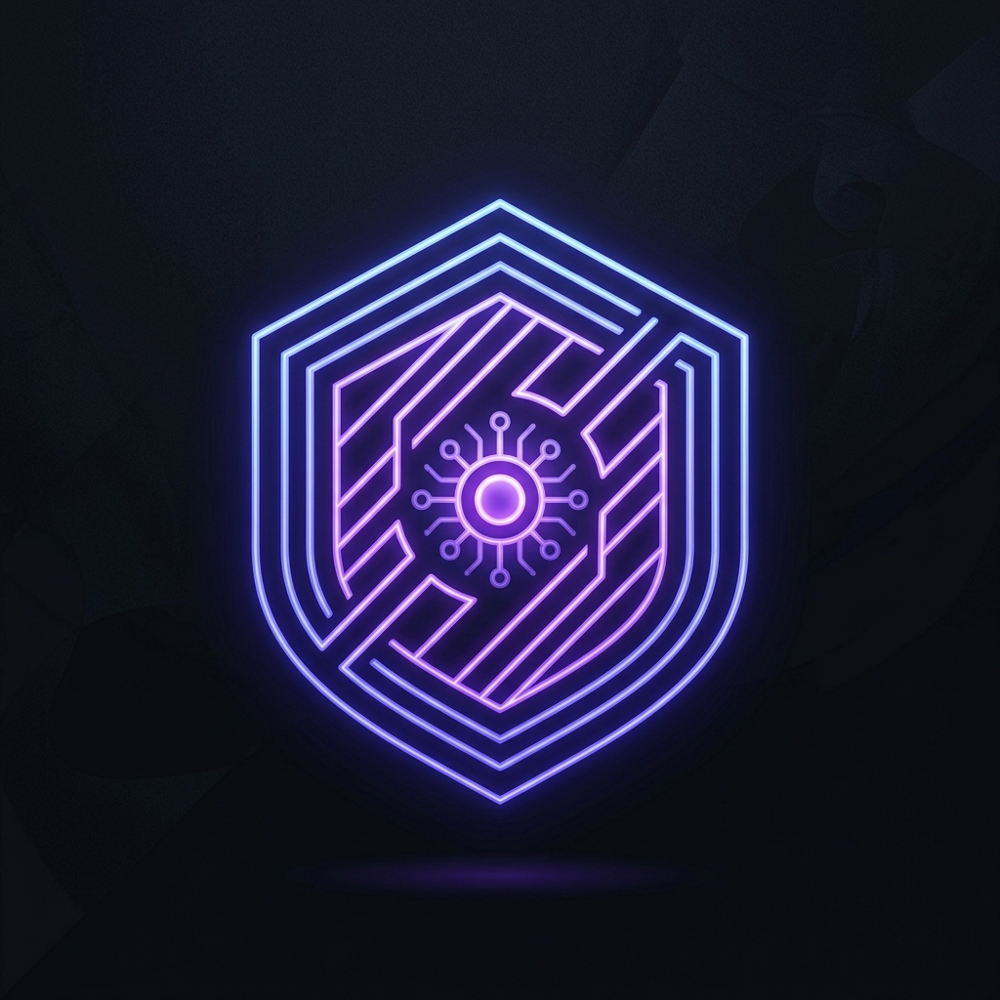
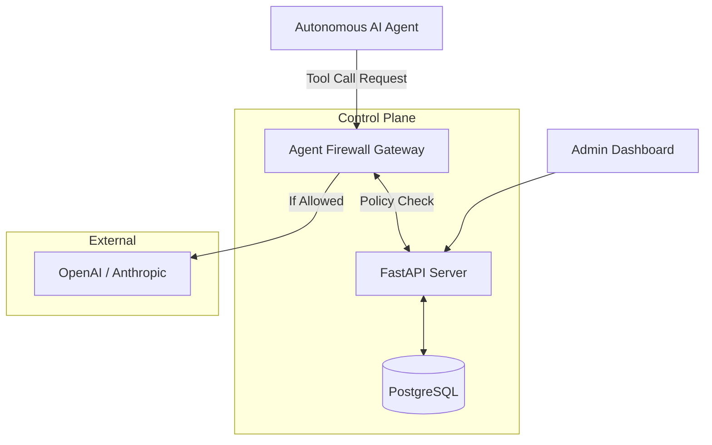

<p align="center">
  
</p>

<h1 align="center">Agent Firewall 🛡️</h1>

<p align="center">
  <strong>The definitive security and observability control plane for Autonomous AI Agents.</strong>
</p>

<p align="center">
  <a href="https://github.com/lokeshsk/zerotrust-agents/stargazers"></a>
  <a href="https://github.com/lokeshsk/zerotrust-agents/blob/main/LICENSE"></a>
  <a href="https://zerotrust-agents.com"></a>
  <a href="https://docs.zerotrust-agents.com"></a>
</p>

<!-- 
TODO: Add Demo GIF or YouTube Video embed here
Example: 
<p align="center">
  <a href="https://youtu.be/YOUR_VIDEO_ID"></a>
</p>
-->

<p align="center">
  <a href="#quickstart">Quickstart</a> •
  <a href="#features">Features</a> •
  <a href="#architecture">Architecture</a> •
  <a href="#mcp-model-context-protocol">MCP Protocol</a> •
  <a href="#documentation">Documentation</a> •
  <a href="#enterprise-edition">Enterprise Edition</a>
</p>

---

## Why ZeroTrust Agents?
As AI Agents become increasingly autonomous (executing SQL, calling external APIs, writing to databases), organizations need a centralized security layer to prevent rogue actions, ensure compliance, and monitor AI behavior in real time.

**ZeroTrust Agents** acts as an enterprise-grade API Gateway that sits securely between your AI Agent and its LLM provider (OpenAI, Anthropic, Gemini, etc.). It intercepts the agent's attempts to use tools and evaluates those actions against a strict, zero-trust security policy engine before allowing them to execute.

## Features
- **🔥 LiteLLM Proxy Engine**: Agnostic proxy that intercepts traffic and forces LLMs to adhere to predefined tool-use policies. We support the `OpenAI`, `Anthropic`, and `Gemini` tool-use specification formats natively.
- **🛡️ Semantic DLP**: Scans arguments sent to tools for destructive commands (e.g., `DROP TABLE`) and PII using secondary lightweight local LLMs. Go beyond regex.
- **⏸️ Human-in-the-Loop (HITL)**: Suspend high-risk agent operations until a human administrator clicks "Approve" or "Block" in the visual dashboard.
- **🗺️ Auto-Discovery Graph**: Automatically maps and visualizes the relationships between your AI agents and the external tools they are trying to use.
- **🔌 Model Context Protocol (MCP)**: Native support for Anthropic's MCP, allowing you to proxy MCP tool calls natively through the gateway.
- **👥 Multi-Tenancy Setup**: The entire architecture is partitioned by `tenant_id` for SaaS deployments.

## Quickstart

Getting started is easy. You can run the entire Agent Firewall stack (Gateway, API, Database, and Dashboard) locally with a single command.

### 1-Click Launch
We provide an interactive launcher that manages dependencies for you.

```bash
git clone https://github.com/lokeshsk/agent-firewall.git
cd agent-firewall
chmod +x start.sh

# Run the interactive setup!
./start.sh
```

When prompted, select **[1] Docker Compose (Recommended)** to spin up the containerized stack, or **[2] Natively** to run it directly on your machine (Requires Python 3.10+, Node 20+, and PostgreSQL).

Once booted, open the Dashboard at: **[http://localhost:3000](http://localhost:3000)** (or your custom `APP_URL`).

### Environment Variables
Upon first launch, `./start.sh` automatically copies `.env.example` to `.env`. 
Open `.env` and set your Upstream API Keys so the Gateway can route requests for your agents:
```env
OPENAI_API_KEY="sk-your-openai-key"
ANTHROPIC_API_KEY="sk-ant-your-anthropic-key"
APP_URL="http://localhost:3000"
```

## Architecture



1. **Gateway (`apps/gateway/`)**: A high-performance proxy written in Python/FastAPI. Intercepts agent traffic, runs anomaly detection, extracts requested tool invocations, evaluates policies, and queries the Control Plane.
2. **API Control Plane (`apps/api/`)**: A backend managing Workspaces, Policies, Audit Logs, and pending HITL approvals.
3. **Dashboard (`apps/web/`)**: A Next.js 15 frontend App Console utilizing Tailwind CSS and a premium dark-mode aesthetic.
4. **Website & Docs (`apps/website/` and `apps/docs/`)**: Next.js applications that serve the main landing page and Fumadocs-powered documentation, tied together using Next.js Multi-Zones.

## MCP (Model Context Protocol)

Agent Firewall natively supports Anthropic's **Model Context Protocol (MCP)**.
Instead of giving LLMs unmitigated direct access to your local filesystem or databases, you can route your MCP connections through the Firewall.
The Gateway intercepts the JSON-RPC messages, inspects the `CallToolRequest`, and blocks actions like `write_file` or `execute_query` based on your policies, all while keeping the connection stateful.

## Documentation

Comprehensive documentation is available for deployment, configuration, and writing custom Semantic DLP plugins.
To run the documentation locally:
```bash
turbo run dev --filter=docs
```

## Open Source vs Enterprise Edition
Agent Firewall operates on an Open Core model. 

* **Community Edition (Open Source)**: Includes the core firewall proxy, semantic DLP, basic HITL flows, and master key authentication.
* **Enterprise Edition (EE)**: Distributed privately for enterprise customers. Unlocks:
  - Auth0 / Active Directory SSO
  - Multi-Tenant Workspaces & RBAC
  - Advanced SIEM Webhooks (Splunk/Datadog)
  - Cost Controls & Hard Billing Budgets

*If you are interested in an Enterprise License, please visit our website at [zerotrust-agents.com](https://zerotrust-agents.com).*

---
<p align="center">
  Built with ❤️ for secure AI.
</p>
